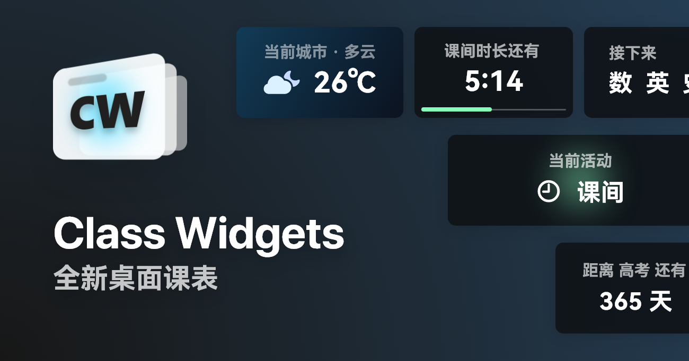

<a href="/profile/README.md">简体中文</a> | English

    

    <h1 align="center">
    Class Widgets
</h1>

    Brand New Desktop Class Schedule

#### [📦 Go to Main Repository](https://github.com/Class-Widgets/Class-Widgets)

#### [Learn more on Bilibili >](https://www.bilibili.com/video/BV1xwW9eyEGu/)

> [!TIP]
> Class Widgets has launched a new **📃 Official Tutorial**! Check it out [here](https://cwdocs.rinlit.cn/instruction/).

## Installation & Usage

#### Check System Requirements
First, make sure your device meets the following requirements (these requirements apply only when running on Windows):

> [!NOTE]
> **🚧 Compatibility:** Class Widgetss fully supports Windows 7.
> But about Linux: You can download the latest build, but compatibility may be limited.

| **🖥️ OS** | **🗄️ RAM** | **📦 Runtime** |
| :-----: | :-----: | :------: |
| **Windows 7** or later | ≥4GB | *No special requirements* |

If you **meet** these requirements, proceed to the next steps.

#### Download Class Widgets
You can download the latest Class Widgets from the Releases page of this GitHub repository:
> **About beta versions:** Beta versions make you try the newest features early, but may have unexpected issues. You can download the latest test builds from the Actions page.

|  **📃 Stable**   |  **🚧 Beta**   |
| :------------------------------: | :------------------------------: |
| [Go to Releases](https://github.com/Class-Widgets/Class-Widgets/releases) | [Go to Actions](https://github.com/Class-Widgets/Class-Widgets/actions) |

#### Extract & Run
After downloading, extract the software to a **suitable location**, then find and run `ClassWidgets.exe` or `ClassWidgets` in the extracted folder.

## Community
We currently have [GitHub Discussions](https://github.com/orgs/Class-Widgets/discussions), a [QQ Group](http://qm.qq.com/cgi-bin/qm/qr?_wv=1027&k=yHXKCAjOxlpTpJ4mNdXm0mxOneYUinRs&authKey=sd3%2F06iGdOZUjkXXPBeIzGnFDIeYwmdwuM8dhk25fi%2B1CUL32MkeN2EEfjdo2pzE&noverify=0&group_code=169200380), and a [Discord server](https://discord.gg/EFF4PpqpqZ).

### For further steps, see the [User Docs](https://cwdocs.rinlit.cn/about/).
### If you're a developer, please check out the [Developer Docs](https://cwdocs.rinlit.cn/dev/).